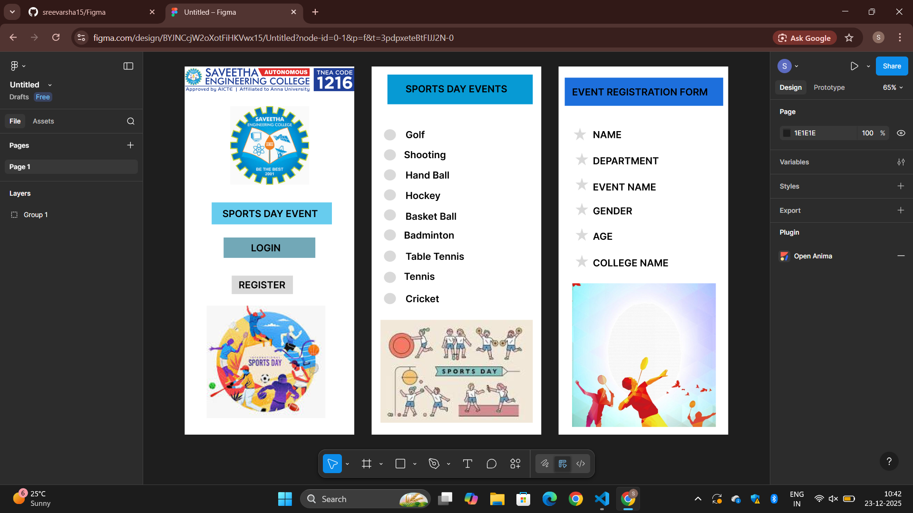

# Ex08 Event Registration Web Application
## Date:
20-12-2025
## AIM:
To design, develop and deploy a web application for event registration using Figma UI tool.

## UI DESIGN TOOL:
Figma


### Step 1:
Use frames to represent screens or sections.

### Step 2:
Add column grids for consistent spacing and alignment.

### Step 3:
Insert shapes, text, buttons, and icons.

### Step 4:
Use Auto Layout for flexible, responsive design.

### Step 5:
Define color, text, and effect styles globally for consistency.

### Step 6:
Name layers logically and group related elements.

### Step 6:
Link frames to show navigation or interactions.

### Step 7:
Select the specific frame while generating code using Anima plugin.

## CODE:
```
index1.html
<!DOCTYPE html>
<html>
  <head>
    <meta name="viewport" content="width=device-width, initial-scale=1" />
    <meta charset="utf-8" />
    <link rel="stylesheet" href="globals.css" />
    <link rel="stylesheet" href="style.css" />
  </head>
  <body>
    <div class="iphone-pro-max">
      
      
      <div class="rectangle"></div>
      <div class="text-wrapper">SPORTS DAY EVENT</div>
      <div class="div"></div>
      <div class="text-wrapper-2">LOGIN</div>
      <div class="rectangle-2"></div>
      <div class="text-wrapper-3">REGISTER</div>
      
    </div>
  </body>
</html>

style1.css
.iphone-pro-max {
  position: relative;
  width: 440px;
  height: 956px;
  background-color: #ffffff;
}

.iphone-pro-max .logo {
  position: absolute;
  top: 0;
  left: 0;
  width: 440px;
  height: 69px;
  aspect-ratio: 6.54;
}

.iphone-pro-max .img {
  position: absolute;
  top: 103px;
  left: 118px;
  width: 205px;
  height: 204px;
  aspect-ratio: 1;
  object-fit: cover;
}

.iphone-pro-max .rectangle {
  position: absolute;
  top: 353px;
  left: 70px;
  width: 312px;
  height: 57px;
  background-color: #66ccee;
}

.iphone-pro-max .text-wrapper {
  position: absolute;
  top: 367px;
  left: 98px;
  font-family: "Inter-SemiBold", Helvetica;
  font-weight: 600;
  color: #000000;
  font-size: 25px;
  letter-spacing: 0;
  line-height: normal;
  white-space: nowrap;
}

.iphone-pro-max .div {
  position: absolute;
  top: 444px;
  left: 101px;
  width: 238px;
  height: 53px;
  background-color: #72a8b7;
}

.iphone-pro-max .text-wrapper-2 {
  position: absolute;
  top: 456px;
  left: 172px;
  font-family: "Inter-SemiBold", Helvetica;
  font-weight: 600;
  color: #000000;
  font-size: 25px;
  letter-spacing: 0;
  line-height: normal;
  white-space: nowrap;
}

.iphone-pro-max .rectangle-2 {
  position: absolute;
  top: 543px;
  left: 122px;
  width: 159px;
  height: 48px;
  background-color: #d9d9d9;
}

.iphone-pro-max .text-wrapper-3 {
  position: absolute;
  top: 552px;
  left: 140px;
  font-family: "Inter-SemiBold", Helvetica;
  font-weight: 600;
  color: #000000;
  font-size: 25px;
  letter-spacing: 0;
  line-height: normal;
  white-space: nowrap;
}

.iphone-pro-max .image {
  position: absolute;
  top: 621px;
  left: 57px;
  width: 308px;
  height: 292px;
  aspect-ratio: 1.05;
  object-fit: cover;
}

index2.html
<!DOCTYPE html>
<html>
  <head>
    <meta name="viewport" content="width=device-width, initial-scale=1" />
    <meta charset="utf-8" />
    <link rel="stylesheet" href="globals.css" />
    <link rel="stylesheet" href="style.css" />
  </head>
  <body>
    <div class="iphone-pro-max">
      
      <div class="rectangle"></div>
      <div class="text-wrapper">SPORTS DAY EVENTS</div>
      <div class="ellipse"></div>
      <div class="div"></div>
      <div class="ellipse-2"></div>
      <div class="ellipse-3"></div>
      <div class="ellipse-4"></div>
      <div class="ellipse-5"></div>
      <div class="ellipse-4"></div>
      <div class="ellipse-6"></div>
      <div class="ellipse-7"></div>
      <div class="ellipse-8"></div>
      <div class="text-wrapper-2">Golf</div>
      <div class="text-wrapper-3">Shooting</div>
      <div class="text-wrapper-4">Hand Ball</div>
      <div class="text-wrapper-5">Hockey</div>
      <div class="text-wrapper-6">Basket Ball</div>
      <div class="text-wrapper-7">Badminton</div>
      <div class="text-wrapper-8">Table Tennis</div>
      <div class="text-wrapper-9">Tennis</div>
      <div class="text-wrapper-10">Cricket</div>
      
    </div>
  </body>
</html>

style2.css
.iphone-pro-max {
  position: relative;
  width: 440px;
  height: 956px;
  background-color: #ffffff;
}

.iphone-pro-max .text-on-a-path {
  position: absolute;
  top: 44px;
  left: 48px;
  width: 367px;
  height: 62px;
}

.iphone-pro-max .rectangle {
  position: absolute;
  top: 21px;
  left: 41px;
  width: 377px;
  height: 77px;
  background-color: #0799d3;
}

.iphone-pro-max .text-wrapper {
  position: absolute;
  top: 43px;
  left: 88px;
  font-family: "Inter-SemiBold", Helvetica;
  font-weight: 600;
  color: #000000;
  font-size: 25px;
  letter-spacing: 0;
  line-height: normal;
  white-space: nowrap;
}

.iphone-pro-max .ellipse {
  top: 163px;
  position: absolute;
  left: 32px;
  width: 31px;
  height: 29px;
  background-color: #d9d9d9;
  border-radius: 15.5px / 14.5px;
}

.iphone-pro-max .div {
  top: 215px;
  position: absolute;
  left: 32px;
  width: 31px;
  height: 29px;
  background-color: #d9d9d9;
  border-radius: 15.5px / 14.5px;
}

.iphone-pro-max .ellipse-2 {
  top: 267px;
  position: absolute;
  left: 32px;
  width: 31px;
  height: 29px;
  background-color: #d9d9d9;
  border-radius: 15.5px / 14.5px;
}

.iphone-pro-max .ellipse-3 {
  top: 319px;
  position: absolute;
  left: 32px;
  width: 31px;
  height: 29px;
  background-color: #d9d9d9;
  border-radius: 15.5px / 14.5px;
}

.iphone-pro-max .ellipse-4 {
  position: absolute;
  top: 371px;
  left: 32px;
  width: 31px;
  height: 29px;
  background-color: #d9d9d9;
  border-radius: 15.5px / 14.5px;
}

.iphone-pro-max .ellipse-5 {
  top: 423px;
  position: absolute;
  left: 32px;
  width: 31px;
  height: 29px;
  background-color: #d9d9d9;
  border-radius: 15.5px / 14.5px;
}

.iphone-pro-max .ellipse-6 {
  top: 478px;
  position: absolute;
  left: 32px;
  width: 31px;
  height: 29px;
  background-color: #d9d9d9;
  border-radius: 15.5px / 14.5px;
}

.iphone-pro-max .ellipse-7 {
  top: 533px;
  position: absolute;
  left: 32px;
  width: 31px;
  height: 29px;
  background-color: #d9d9d9;
  border-radius: 15.5px / 14.5px;
}

.iphone-pro-max .ellipse-8 {
  top: 588px;
  position: absolute;
  left: 32px;
  width: 31px;
  height: 29px;
  background-color: #d9d9d9;
  border-radius: 15.5px / 14.5px;
}

.iphone-pro-max .text-wrapper-2 {
  position: absolute;
  top: 162px;
  left: 88px;
  font-family: "Inter-SemiBold", Helvetica;
  font-weight: 600;
  color: #000000;
  font-size: 25px;
  letter-spacing: 0;
  line-height: normal;
  white-space: nowrap;
}

.iphone-pro-max .text-wrapper-3 {
  position: absolute;
  top: 214px;
  left: 84px;
  font-family: "Inter-SemiBold", Helvetica;
  font-weight: 600;
  color: #000000;
  font-size: 25px;
  letter-spacing: 0;
  line-height: normal;
  white-space: nowrap;
}

.iphone-pro-max .text-wrapper-4 {
  position: absolute;
  top: 267px;
  left: 88px;
  font-family: "Inter-SemiBold", Helvetica;
  font-weight: 600;
  color: #000000;
  font-size: 25px;
  letter-spacing: 0;
  line-height: normal;
  white-space: nowrap;
}

.iphone-pro-max .text-wrapper-5 {
  position: absolute;
  top: 320px;
  left: 88px;
  font-family: "Inter-SemiBold", Helvetica;
  font-weight: 600;
  color: #000000;
  font-size: 25px;
  letter-spacing: 0;
  line-height: normal;
  white-space: nowrap;
}

.iphone-pro-max .text-wrapper-6 {
  position: absolute;
  top: 374px;
  left: 88px;
  font-family: "Inter-SemiBold", Helvetica;
  font-weight: 600;
  color: #000000;
  font-size: 25px;
  letter-spacing: 0;
  line-height: normal;
  white-space: nowrap;
}

.iphone-pro-max .text-wrapper-7 {
  position: absolute;
  top: 423px;
  left: 84px;
  width: 131px;
  font-family: "Inter-SemiBold", Helvetica;
  font-weight: 600;
  color: #000000;
  font-size: 25px;
  letter-spacing: 0;
  line-height: normal;
}

.iphone-pro-max .text-wrapper-8 {
  position: absolute;
  top: 478px;
  left: 88px;
  font-family: "Inter-SemiBold", Helvetica;
  font-weight: 600;
  color: #000000;
  font-size: 25px;
  letter-spacing: 0;
  line-height: normal;
  white-space: nowrap;
}

.iphone-pro-max .text-wrapper-9 {
  position: absolute;
  top: 530px;
  left: 84px;
  font-family: "Inter-SemiBold", Helvetica;
  font-weight: 600;
  color: #000000;
  font-size: 25px;
  letter-spacing: 0;
  line-height: normal;
  white-space: nowrap;
}

.iphone-pro-max .text-wrapper-10 {
  position: absolute;
  top: 588px;
  left: 88px;
  font-family: "Inter-SemiBold", Helvetica;
  font-weight: 600;
  color: #000000;
  font-size: 25px;
  letter-spacing: 0;
  line-height: normal;
  white-space: nowrap;
}

.iphone-pro-max .image {
  position: absolute;
  top: 658px;
  left: 23px;
  width: 395px;
  height: 267px;
  aspect-ratio: 1.48;
  object-fit: cover;
}

index3.html
<!DOCTYPE html>
<html>
  <head>
    <meta name="viewport" content="width=device-width, initial-scale=1" />
    <meta charset="utf-8" />
    <link rel="stylesheet" href="globals.css" />
    <link rel="stylesheet" href="style.css" />
  </head>
  <body>
    <div class="iphone-pro-max">
      <div class="rectangle"></div>
      <div class="text-wrapper">EVENT REGISTRATION FORM</div>
      
      
      
      
      
      
      
      <div class="div">COLLEGE NAME</div>
      <div class="text-wrapper-2">AGE</div>
      <div class="text-wrapper-3">GENDER</div>
      <div class="text-wrapper-4">NAME</div>
      <div class="text-wrapper-5">DEPARTMENT</div>
      <div class="text-wrapper-6">EVENT NAME</div>
      
    </div>
  </body>
</html>
 
 style3.css
.iphone-pro-max {
  position: relative;
  width: 440px;
  height: 956px;
  background-color: #ffffff;
}

.iphone-pro-max .rectangle {
  position: absolute;
  top: 29px;
  left: 16px;
  width: 411px;
  height: 73px;
  background-color: #1c6fdb;
}

.iphone-pro-max .text-wrapper {
  position: absolute;
  top: 51px;
  left: 35px;
  font-family: "Inter-SemiBold", Helvetica;
  font-weight: 600;
  color: #000000;
  font-size: 25px;
  letter-spacing: 0;
  line-height: normal;
  white-space: nowrap;
}

.iphone-pro-max .star {
  position: absolute;
  top: 159px;
  left: 39px;
  width: 33px;
  height: 33px;
}

.iphone-pro-max .img {
  top: 224px;
  position: absolute;
  left: 44px;
  width: 33px;
  height: 33px;
}

.iphone-pro-max .star-2 {
  top: 289px;
  position: absolute;
  left: 44px;
  width: 33px;
  height: 33px;
}

.iphone-pro-max .star-3 {
  top: 354px;
  position: absolute;
  left: 44px;
  width: 33px;
  height: 33px;
}

.iphone-pro-max .star-4 {
  top: 420px;
  position: absolute;
  left: 44px;
  width: 33px;
  height: 33px;
}

.iphone-pro-max .star-5 {
  top: 489px;
  position: absolute;
  left: 44px;
  width: 33px;
  height: 33px;
}

.iphone-pro-max .div {
  position: absolute;
  top: 495px;
  left: 89px;
  font-family: "Inter-SemiBold", Helvetica;
  font-weight: 600;
  color: #000000;
  font-size: 25px;
  letter-spacing: 0;
  line-height: normal;
  white-space: nowrap;
}

.iphone-pro-max .text-wrapper-2 {
  position: absolute;
  top: 426px;
  left: 89px;
  font-family: "Inter-SemiBold", Helvetica;
  font-weight: 600;
  color: #000000;
  font-size: 25px;
  letter-spacing: 0;
  line-height: normal;
  white-space: nowrap;
}

.iphone-pro-max .text-wrapper-3 {
  position: absolute;
  top: 360px;
  left: 89px;
  font-family: "Inter-SemiBold", Helvetica;
  font-weight: 600;
  color: #000000;
  font-size: 25px;
  letter-spacing: 0;
  line-height: normal;
  white-space: nowrap;
}

.iphone-pro-max .text-wrapper-4 {
  position: absolute;
  top: 162px;
  left: 89px;
  font-family: "Inter-SemiBold", Helvetica;
  font-weight: 600;
  color: #000000;
  font-size: 25px;
  letter-spacing: 0;
  line-height: normal;
  white-space: nowrap;
}

.iphone-pro-max .text-wrapper-5 {
  position: absolute;
  top: 230px;
  left: 89px;
  font-family: "Inter-SemiBold", Helvetica;
  font-weight: 600;
  color: #000000;
  font-size: 25px;
  letter-spacing: 0;
  line-height: normal;
  white-space: nowrap;
}

.iphone-pro-max .text-wrapper-6 {
  position: absolute;
  top: 298px;
  left: 89px;
  font-family: "Inter-SemiBold", Helvetica;
  font-weight: 600;
  color: #000000;
  font-size: 25px;
  letter-spacing: 0;
  line-height: normal;
  white-space: nowrap;
}

.iphone-pro-max .image {
  position: absolute;
  top: 563px;
  left: 35px;
  width: 373px;
  height: 373px;
  aspect-ratio: 1;
  object-fit: cover;
}
```
## OUTPUT:


## RESULT:
The program to design, develop and deploy a web application for event registration using Figma UI tool is completed successfully.
